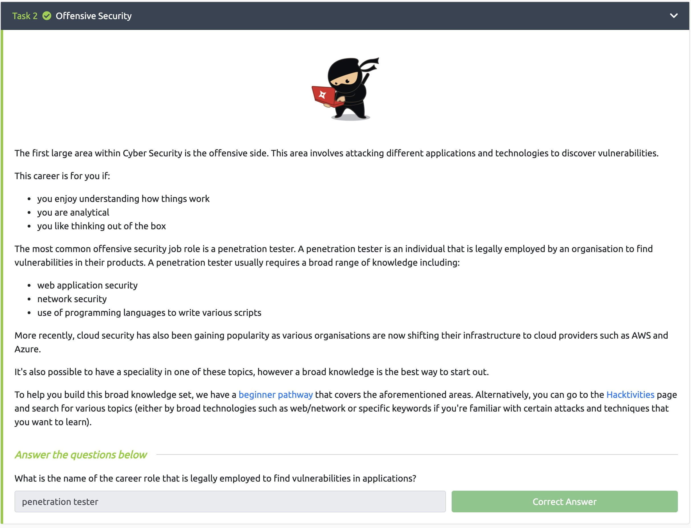
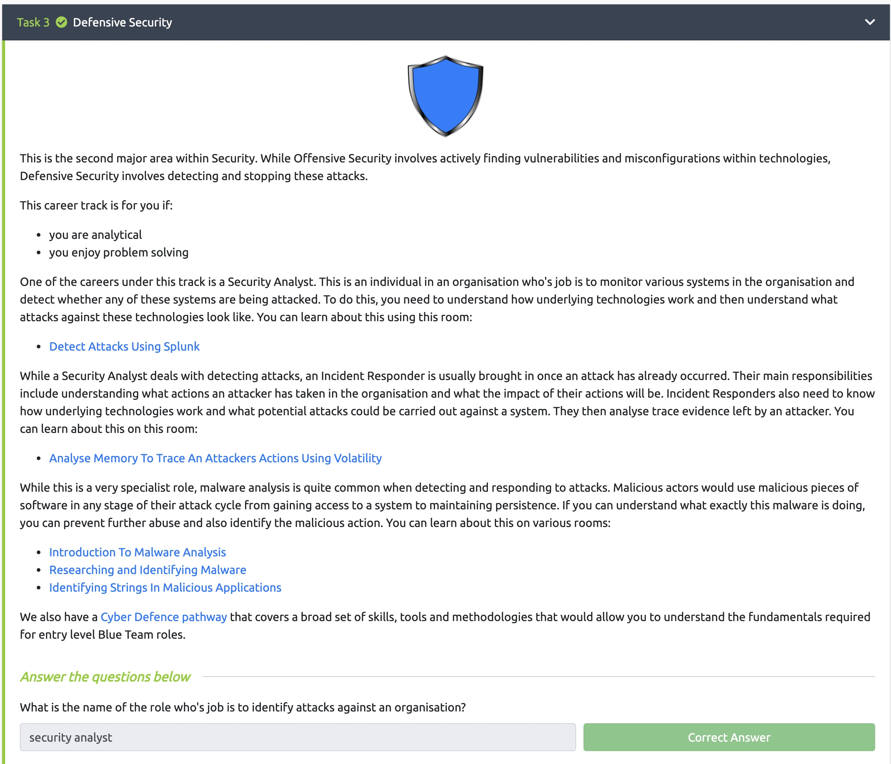

# Lab 1

### Juan Mercado
### February 4th, 2022

#### Overview

##### Task 1:

I read through Task 1 and briefly looked through the Hacktivities and learning paths pages provided.

##### Task 2:

Task 2 described one of the largest areas in the Cyber Security field which is offensive security and that the most common job is a penetration tester. When I finished reading the passage I answered the question correctly.

##### Task 3:

Task 3 described another important area in the Cyber Security field which is focused on defensive security. The passage also described different careers in this area such as a Security Analyst and an Incident Responder. When I finished reading through the passage I answered the question correctly.
