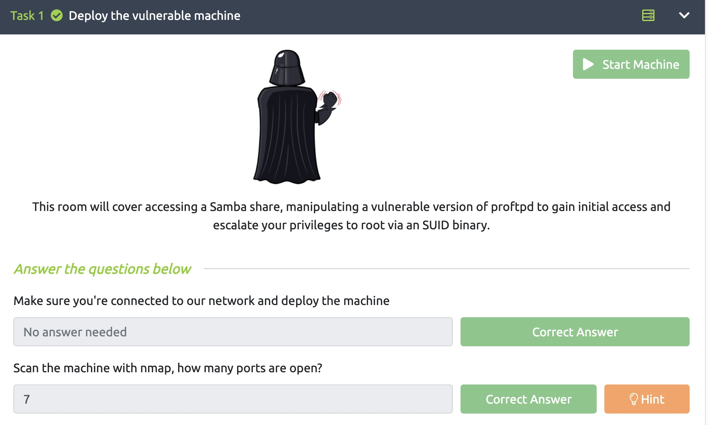
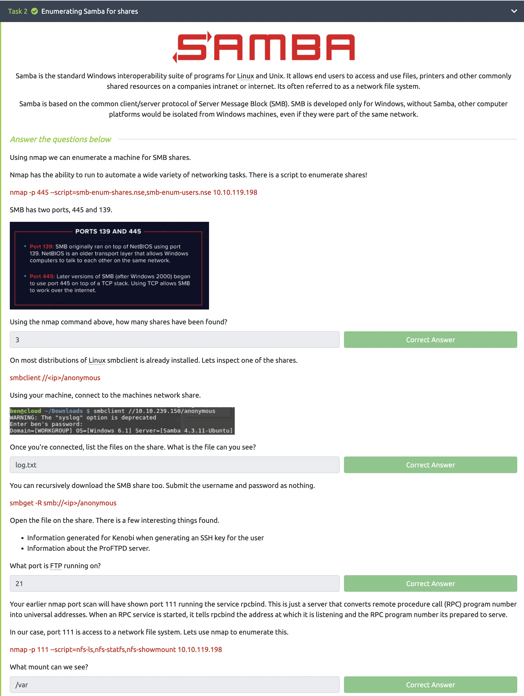
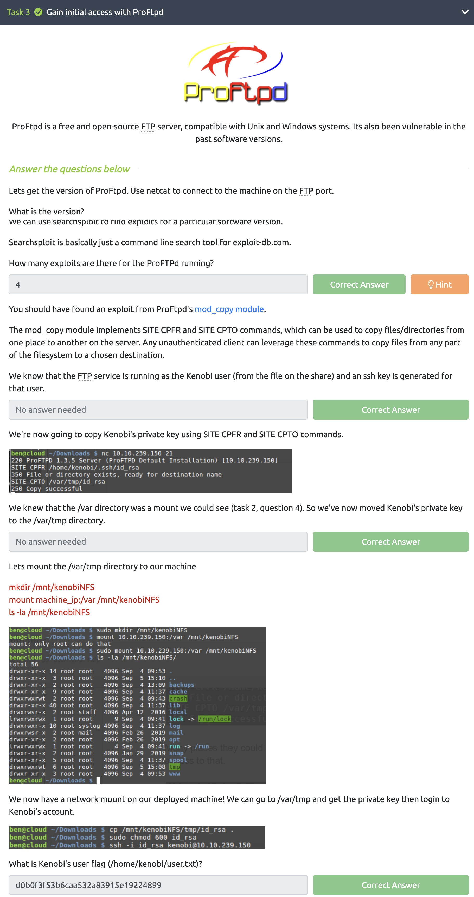
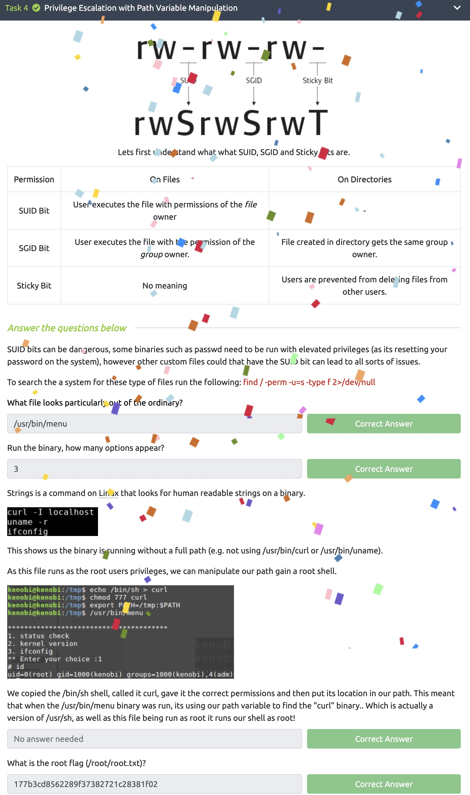

# Lab 10

### Juan Mercado
### April 29th, 2022

#### Overview

##### Task 1:

I deployed the Kenobi vitrual machine and performed an nmap scan to answer the question.

##### Task 2:

I used various commands such as nmap, smbclient, and smbget to gather the information needed to answer the questions.

##### Task 3:

I used netcat to connect to the virtual machine and followed the directions in order to find the answers to the questions.

##### Task 4:

I followed the directions and ran the commands provided to find the answers.
