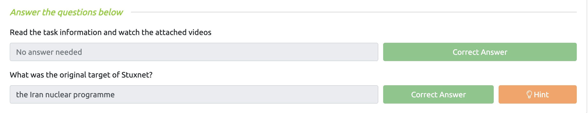
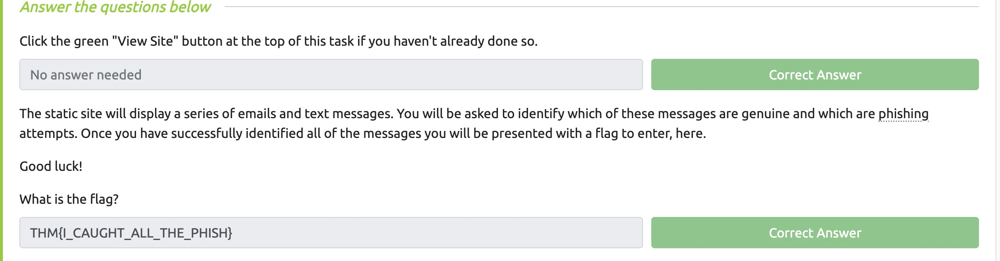
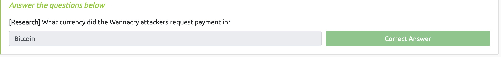
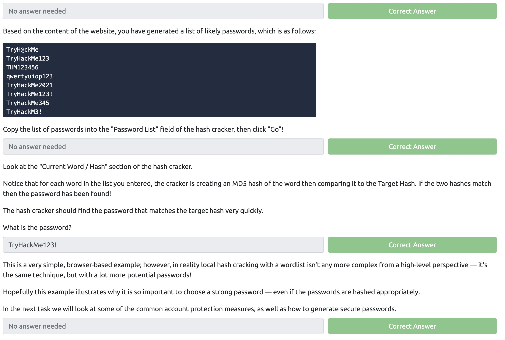
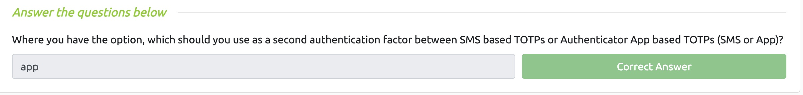
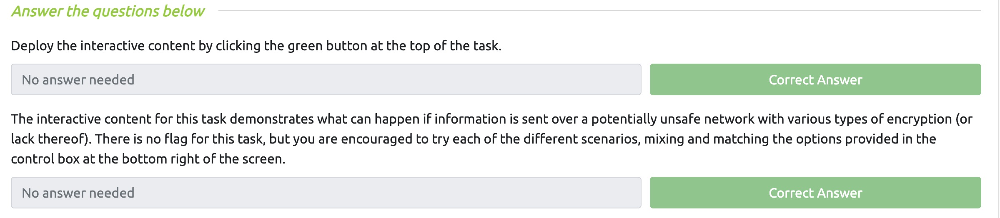
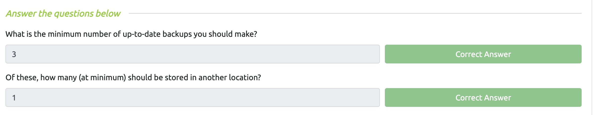
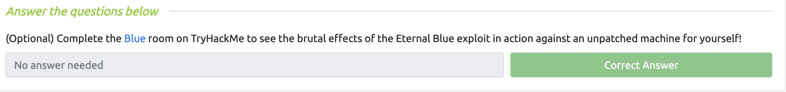

# Lab 2

### Juan Mercado
### February 10th, 2022

#### Overview

##### Task 1:

I read through the Introduction for this week's lab.

##### Task 2:

Social engineering is a cyber attack where a human is a target rather than a person, therefore, it is also known as **People Hacking**. After reading about different forms of social engineering and how to stay safe from those attacks I completed the questions provided.

##### Task 3:

Phishing messages are used by an attacker to trick a victim into opening a malicious web page by sending users emails, text messages, and other forms of communication online. There are three primary types of phishing attacks: General Phishing, Spearphishing, and Whaling. After reading about the different types of phishing attacks and how to identify them I finished the question below the reading.

##### Task 4:

Malware is a software that is designed to perform malicious attacks. Ransomware is a special class of malware and is used to infect as many systems as possible. The purpose of ransomware is to encrypt data on systems making it unaccessible to users and holding it ransom until they pay the attackers within a set time. After reading about the various delivery methods as well as how to stay safe from malware I answered the question provided.

##### Task 5:

Passwords are very important because we use passwords to protect everything we do online when accessing our accounts on various different websites. I learned about what makes a password strong and weak along with what types of attacks can be used by attackers to gain password information. Afterwards I used the hash cracker to help me complete the questions provided.

##### Task 6:

Multi-Factor Authentication is used to require the user to use more than one way to login. In addition, I also learned about other ways to make sure you have secure passwords such as using a password manager that is a safe place to store all of your passwords. I completed the question provided below the reading. 

##### Task 7:

Using wifi in public places can be dangerous because it provides the attackers with the opportunity to attack other people's devices or intercept network traffic to steal sensitive information. There are ways to protect yourself such as not connecting to untrusted networks and also using a VPN when going on the internet. After the reading I went through the interactive content and looked at the examples.
 
##### Task 8:

Backups are one of the most important defensive measures you can take to make sure your data is protected. If you have your information protected no matter what happens you will always be able to recover your data regardless of the damage. The golden rule for backups is called the **3 2 1 rule**. After finsihing the reading I completed the questions.

##### Task 9:

Software updates are very important because they allow the developers to add new features, fix bugs, and make changes to the product. In addition, antivirus packages recieve frequent updates to ensure they are kept up to date. After the reading I completed the Blue Room on TryHackMe.

##### Task 10:

I read through the Conclusion and completed the Common Attacks room.
