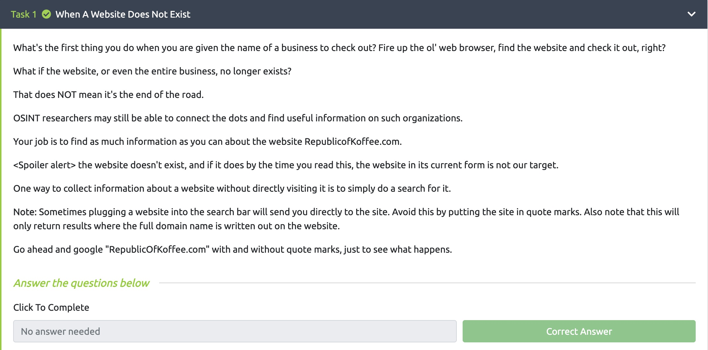
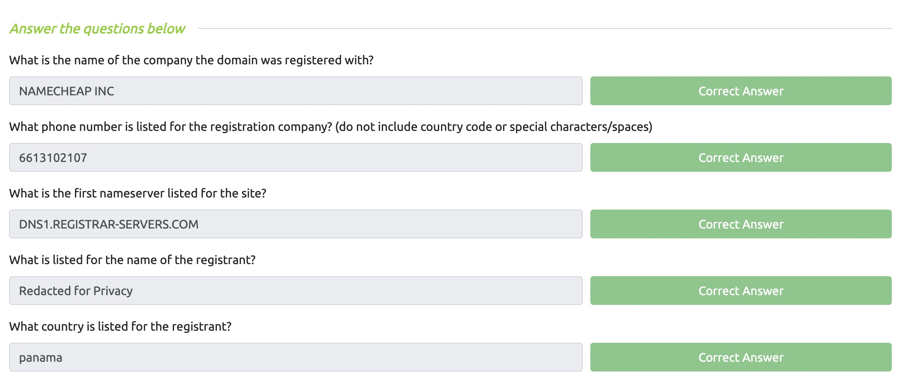
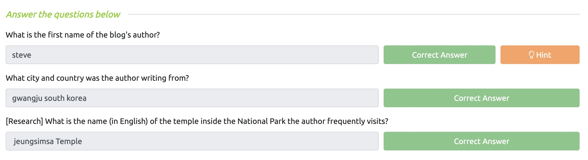
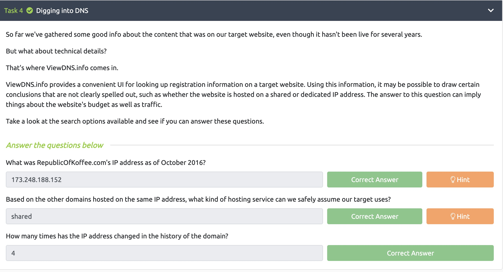
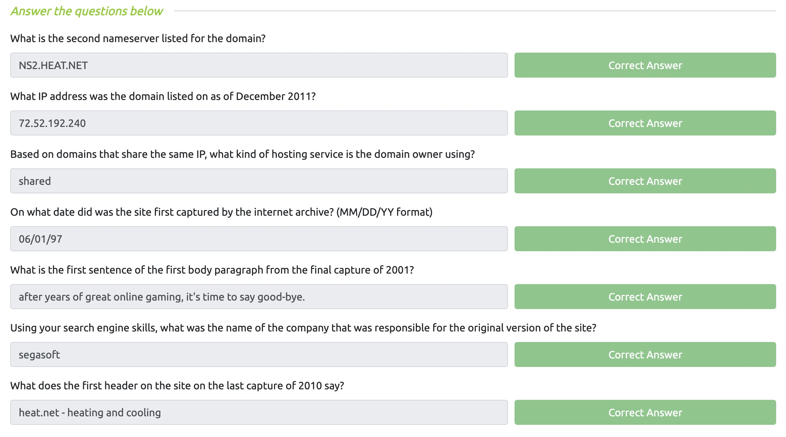
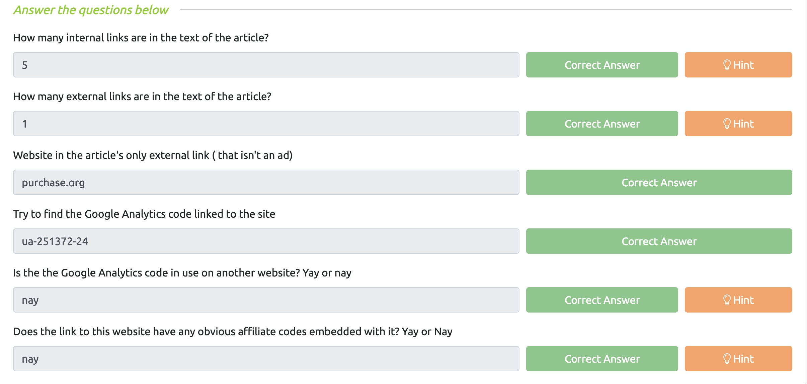
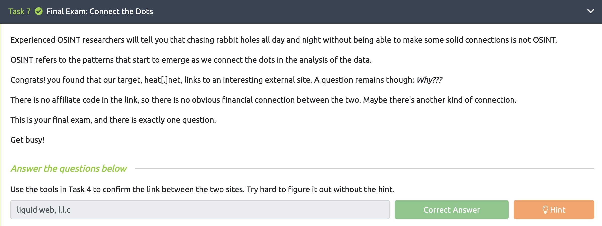
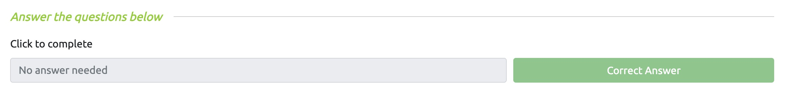
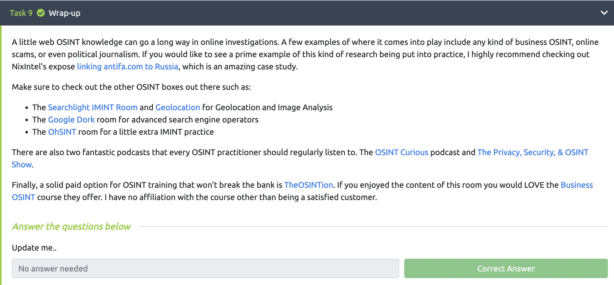

# Lab 3

### Juan Mercado
### February 20th, 2022

#### Overview

##### Task 1:

I completed task 1 and was not able to find the website **RepublicofKoffee.com**.

##### Task 2:

I analyzed the raw data and found information that can be used as pivot points.

##### Task 3:

Using the website **Archive.org** I was able to find information about the website and answer the questions correctly.

##### Task 4:

Using the website **ViewDNS.info** I was able to find the information needed to answer the questions.

##### Task 5:

Utilizing the skills I learned I was able to answer all the questions for the domain **heat[dot]net**.

##### Task 6:

I answered the questions for the website **heat[dot]net/36/need-to-hire-commercial-heating-contractor/**.

##### Task 7:

I used the tools in Task 4 to confirm the link between the two sites.

##### Task 8:

I completed the task provided.

##### Task 9:

I read through the wrap-up provided.
